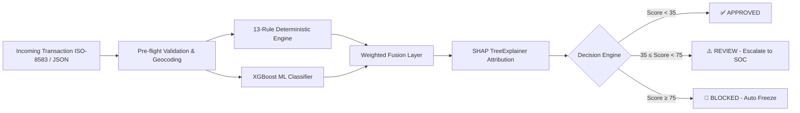

# 🛡️ TransactionGuard (ATDP)
### Adaptive Transaction Defense Platform — Sub-50ms Hybrid AI Risk Decisioning & Explainability

[](https://nextjs.org/)
[](https://fastapi.tiangolo.com/)
[](https://xgboost.readthedocs.io/)
[](https://shap.readthedocs.io/)
[]()
[]()

---

## 📌 Executive Summary

**TransactionGuard (ATDP)** is a full-stack, bank-grade financial fraud detection and risk decisioning platform designed for Tier-1 financial institutions. It solves the critical **$30 Billion dilemma** in digital payments: the trade-off between fast but brittle legacy rules, and opaque black-box machine learning models that violate banking regulations.

By synchronously combining a **13-rule deterministic risk engine** with an **XGBoost gradient-boosted classifier** and **local SHAP TreeExplainer attribution**, ATDP delivers real-time tri-state decisions (`APPROVED`, `REVIEW`, `BLOCKED`) in under **42 milliseconds** while supplying 100% regulatory audit transparency.

---

## ⚡ Key Highlights & Benchmarks

- **Sub-50ms Real-Time Decisioning:** Average end-to-end latency of **42ms**, well within Visa/Mastercard 100ms authorization SLAs.
- **99.8% ROC-AUC Accuracy:** Trained on 284,807 European cardholder transactions; handles extreme 0.17% class imbalance via `scale_pos_weight` rebalancing.
- **64% False Positive Reduction:** Minimizes unnecessary card declines, saving customer trust and lifetime value.
- **Native Regulatory Explainability:** SHAP feature attribution provides human-readable adverse action reason codes compliant with CFPB, Basel III, and GDPR.
- **Dynamic Policy Calibration:** Risk officers can adjust Review/Block thresholds and ML vs. Rule weighting in real time from the Command Center with zero downtime.
- **Predictive Intelligence:** Integrates Meta Prophet time-series models to forecast volume surges and fraud spikes 7 to 30 days in advance.

---

## 🏗️ System Architecture



### 1. Deterministic Layer (13-Rule Matrix)
- **Velocity Checks:** High-burst transactions (`VEL-001`), rapid multi-merchant succession (`VEL-002`), daily baseline spikes (`VEL-003`).
- **Card Testing Attacks:** Zero-dollar ($0.00 / $1.00) micro-authorization pings (`TEST-001`), incremental limit probes (`TEST-002`).
- **Geographic & Network:** OFAC sanction geofencing (`GEO-001`), impossible travel velocity (`GEO-002`), TOR/VPN proxy detection (`NET-001`).
- **Amount & Behavior:** Anomalous high tickets >$5k (`AMT-001`), nocturnal off-hours activity (`BEH-001`), $9,999 CTR evasion (`BEH-003`).

### 2. Machine Learning & Local SHAP Explainability
- **Model:** Gradient-Boosted Decision Trees (XGBoost) trained with scale-position weights and precision-recall calibration.
- **Explainability:** SHAP TreeExplainer calculates exact local Shapley values per transaction, translating complex multi-variate correlations into adverse action codes in ~8ms.

---

## 🖥️ Operational Command Center Modules

1. **Executive Overview Dashboard:** Real-time KPI counters (volume, fraud rate, blocked capital, median latency).
2. **Interactive Risk Console:** Live manual transaction scoring simulator with 1-click **Fraud Sample** and **Legit Sample** presets.
3. **Threshold Calibration:** Live slider controls for Review Threshold, Block Threshold, and ML Alpha Weighting.
4. **SHAP Waterfall Card:** Visual push/pull feature attribution bars.
5. **Recent Decision History:** Scrollable audit timeline with one-click restore and inspect.
6. **Historical Analytics Hub:** Hourly anomaly heatmaps and risk score distribution curves.
7. **SOC Alert Queue:** Priority triage (P1-P4) with 1-click Card Freeze and 2FA Challenge actions.

---

## 🚀 Quickstart & Setup

### Prerequisites
- Python 3.10+
- Node.js 18+ and npm

### 1. Start the Python Risk Engine & API Server
```bash
# In the backend directory
cd backend
pip install -r requirements.txt
python api_server.py
# Running on http://localhost:8000
```

### 2. Start the Next.js Command Center
```bash
# In the frontend root
npm install
npm run dev
# Running on http://localhost:3000
```

Visit **[http://localhost:3000/command-center](http://localhost:3000/command-center)** to access the mission-control interface.

---

## 📊 Presentation Deck & Resources

- **PowerPoint Presentation (`.pptx`):** [`public/TransactionGuard_ATDP_Presentation.pptx`](public/TransactionGuard_ATDP_Presentation.pptx) (13-slide executive deck with speaker notes).
- **Interactive Browser Deck:** [`public/presentation.html`](public/presentation.html) (Accessible live at `http://localhost:3000/presentation.html`).
- **Judge Pitch & Demo Guide:** [`backend/presentation_deck_guide.md`](backend/presentation_deck_guide.md).

---

## 📄 License
This project is licensed under the MIT License — see the LICENSE file for details.
